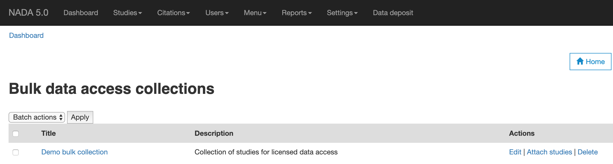

====================================
Bulk Data Access by Collections
====================================

The data access collections allow users to request access to multiple studies by filling in a single request form instead of submitting a new request for each study in the catalog.

To get started, first login as 'Administrator' and then from the admin menu navigate to `Studies` > `Bulk Access Collection`.

Create new collection
------------------------

1. To create a new collection, use the link on the page to open the form. Fill in the Title and Description fields and Save.
2. Next, you'll need to add studies to the collection. Click on the link 'Attach studies' and then select the studies that you want to have in the collection.

Test request form
-------------------

The users will see the option to request bulk access to all studies in the collection or a single study whenever they visit the licenced request form for any of the studies in the collection.

