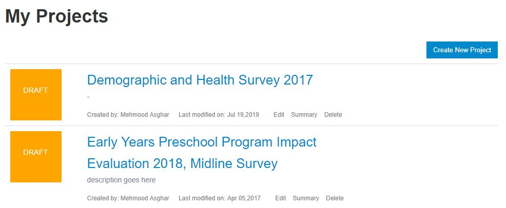
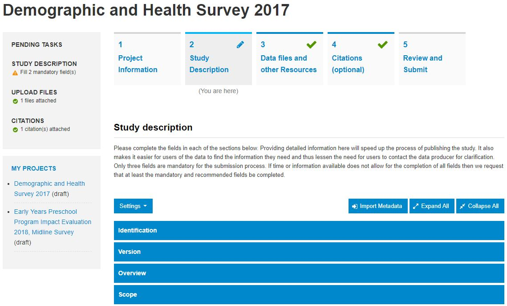
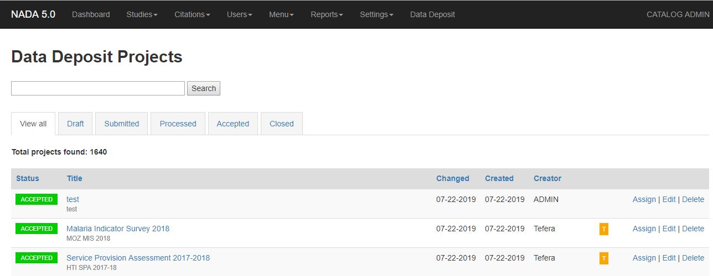

Data Deposit User Guide [DRAFT]
####################################

About Data Deposit
==============================
Agencies and organizations that manage data archives may receive data and metadata from multiple sources. It is important to organize these data deposits to:

* Ensure that all necessary data and metadata are provided

* Minimize the costs of receiving and documenting the datasets for publication

* Maintain information on what is deposited, by whom, and when

* Provide the person or agency who deposits the data with the opportunity to inform the data archive about access restrictions

* Provide the depositor with a "receipt" indicating what has been deposited

The Data Deposit tool is DDI-compliant, open-source software which can be used as part of the NADA package or as a stand-alone tool. It will be useful to agencies that want to implement a simple, user-friendly, yet powerful and secure on-line system for acquiring datasets.

Data Deposit Frontend
==============================
This is the part of the application that is used by the depositors to deposit metadata and/or data.

A data deposit project is composed of:
* Project information
* Detailed project description based on the DDI fields. The form includes over 50+ fields. However, there are only 3 required fields that the user must fill, the rest are optional. The form allows the user to change the form settings to display all, recommended or mandatory fields.
* File uploads - for uploading data files, questionnaires, reports and any other documentation
* Citations
* Data classification

Once a project is submitted, it is locked for any further changes. The system emails receipt of the data deposit to the depositor and the site administrators recieve notification of a new deposit.

The application also allows users to:

* Specify collaborators who can access, edit the deposit project and receive updates about it
* Copy information from existing projects to new projects
* Generate ddi, rdf, print preview and email email project content for review
* Monitor the deposit from submission to publication

Data Deposit Site Admin (backend)
===================================
Data Deposit includes a backend for managing projects submitted by users. To access the backend, go to `Site adminstration > Data Deposit` or navigate to the URL `admin/datadeposit`.

The data deposit admin provides the following features:

* Assign a project to another admin for processing
* Process/review submitted projects
* Export the project to DDI/XML
* Contact depositor for questions or additional information

