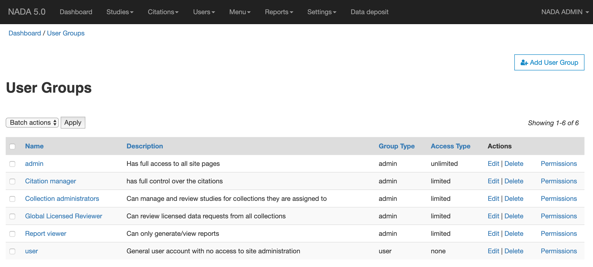
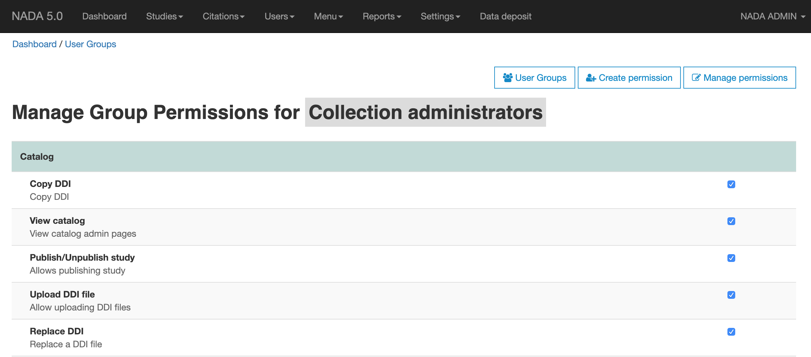
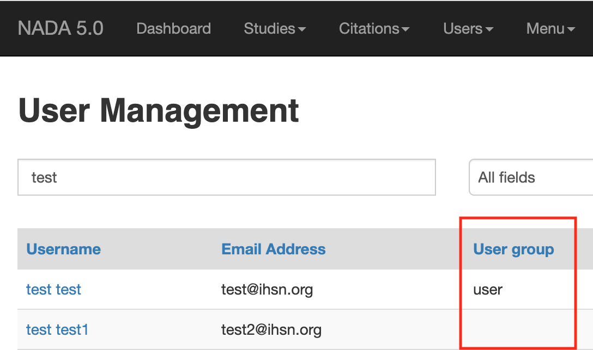
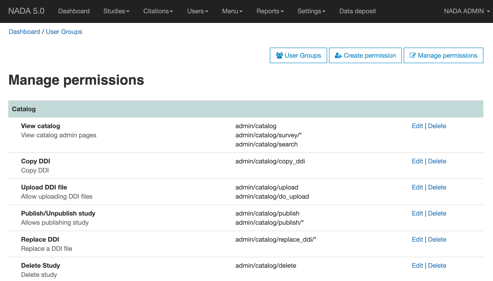
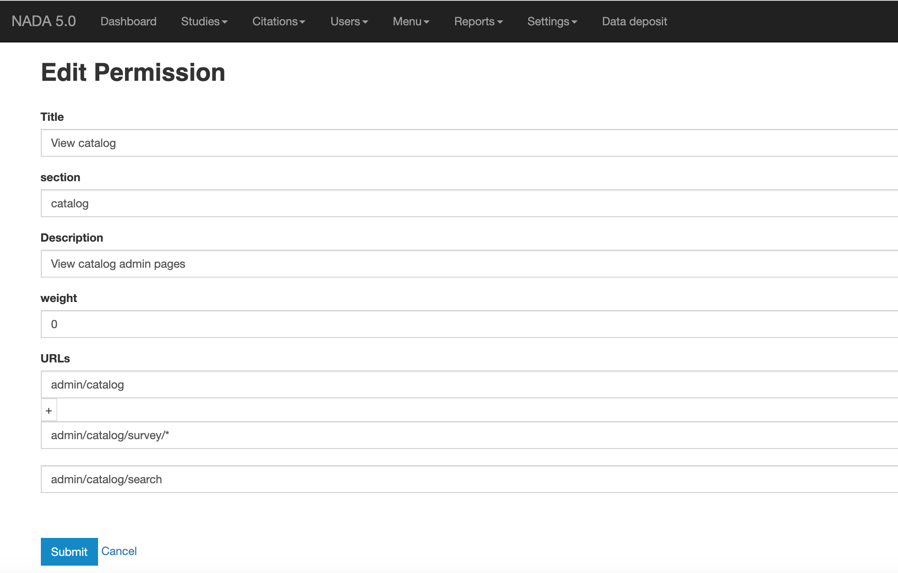

Managing user groups and permissions
######################################

NADA has 3 users groups built-in:

* User
* Admin
* Limited admin access

    - Collection admin
    - Report viewer
    - Citation manager
    - Global Licensed Reviewer  

The permissions are designed around the user groups. 
To change the permissions for the ``limited admin accounts``, follow the steps below:

View user groups
---------------------

1. Login as Site administrator and visit the page http://your-nada/index.php/admin/user_groups.

2. Click on the ``Permissions`` link.

3. Check/uncheck features you want the group to have access to.

4. Click on ``Apply changes`` buton to save your changes.

Troubleshoot permissions
--------------------------

By default, NADA installation includes all site pages that can be managed by the builtin groups. For any reason, 
if a page is inaccessiable with the permission denied message, follow the steps to verify that the user group has 
access to the page and how to fix it.

1. Go to the Site admin > Users page.

2. Find the user by username or email address.

3. Verify that you can see a user group name in the column ``User group``.

4. If no user group is defined, edit user information and select a user group.

5. Test if the permission issue is resolved by setting user group. If not, follow the steps below:

Check page permssions
===============================

1. Open page http://your-nada-catalog/index.php/admin/permissions/manage

2. Verify that the page where the user is getting the access denied message is listed. For example, if the user is unable to upload a ddi and the access denied page url is ``...index.php/admin/catalog/upload``, check the page for any urls that include the full or partial url.

3. If you done't find the URL listed on the page, click on the ``Create permissions`` link or click on the ``Edit`` link to update permissions for an existing site section.

Fill in the edit form.

* Title: Title for the permission section
* Section: Section name
* Description: Description of the section
* URLs: Enter one or more URLs for the page/feature

4. Save the permissions

5. Go to the ``User groups`` page  > click on the ``Permissions`` link for the user group you want to update permissions.

6. Enable/disable permissions for pages/sections for the user group.

7. Save your changes.