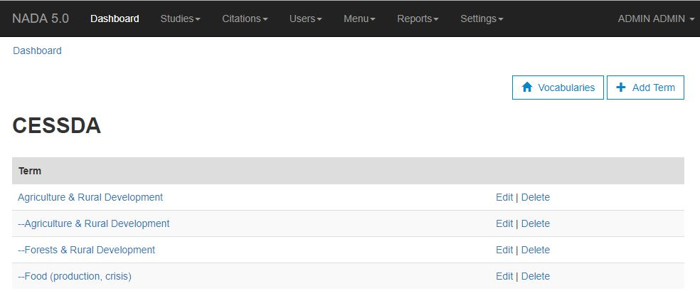
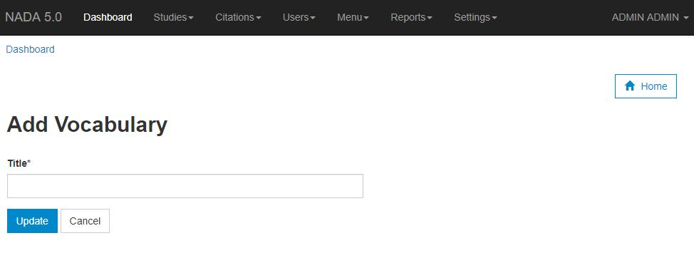
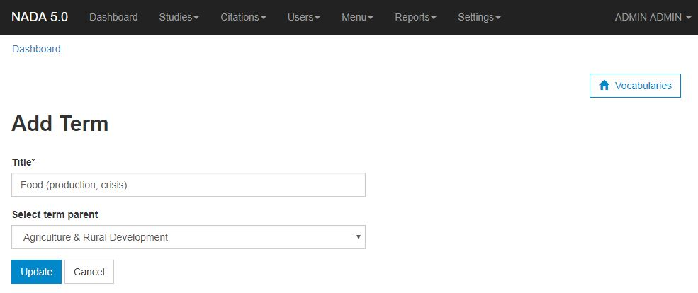
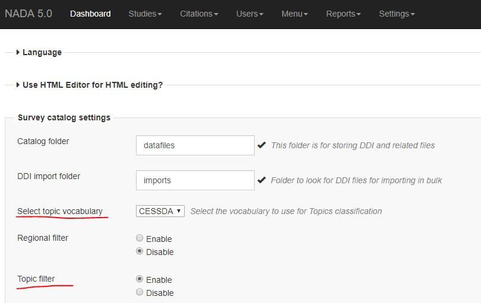

===============
Vocabularies
===============

The topics filter requires that a vocabulary is configured. To setup a vocabulary, go the `site adminstration` > `Settings` > `Vocabularies` page.

Create a new vocabulary
--------------------------

Click on the "Add vocabulary" button to create a new vocabulary. 

Provide a title e.g. CESSDA and click on the `Update` button.

Add terms for the vocabulary
-----------------------------

Click on the link `Terms` to see all terms for the vocabulary. To add a new term, click on the "Add Term" button.

**Title:** Provide a title for the term. If you are using Nesstar publisher and want the terms to link to your studies properly, make sure the titles are exactly the same as in the Nesstar Publisher. Do not include the brackets that Nesstar Publisher appends at end of the topic title.

**Select term parent:** If this is a sub-topic, then use the dropdown to pick the parent topic otherwise leave it empty.

Click on the `Update` button to save your changes.

Configure topic filter to use your vocabulary
-----------------------------------------------

You can have multiple Vocabularies defined but you can only use one at a time for the topics filter. Go to the `Site admin` > `Settings` > `Settings page`. 

Expand the section  `Survey catalog settings`. Use the setting `Select topic vocabulary` to pick the vocabulary you want to activate. 

To enable the topics filter, go the to setting `Topic filter` and select `Enable`.

Save the configurations. 

Topics filter
----------------

Go to the catalog page, you should see the topics filter on the left side bar. Please note, the filter will only show if there are studies that match the topics in your vocabulary. 

If you had studies created before you created your vocabulary, then you will need to reload your DDIs. You can use the DDI Refresh option or you can go to the URL http://your-nada/index.php/admin/batch_refresh to reload metadata for all studies. This will populate the topics and you should be able to filter.

