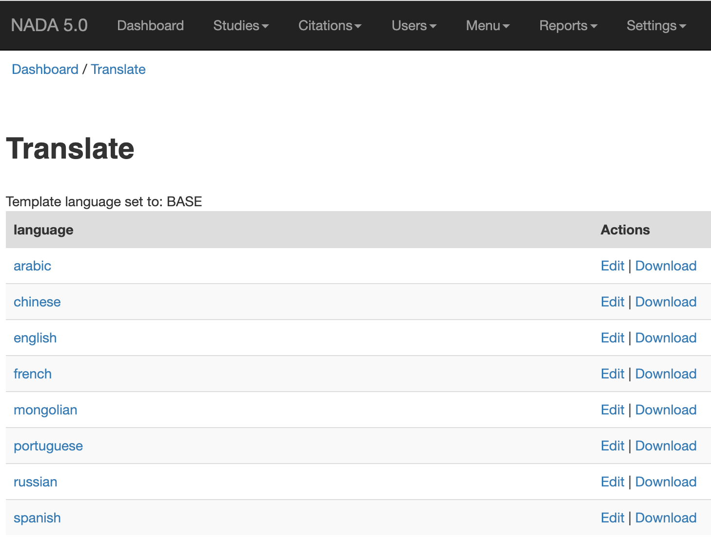
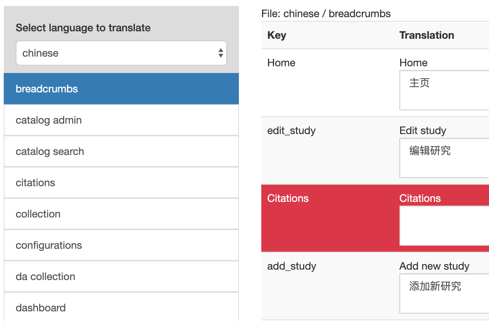

===========================
NADA Translation Guide
===========================

NADA includes a web based translation tool for updating the site’s language or creating new languages for your NADA sites. To start, you will need an admin account to manage translations.

Set language folder permissions
---------------------------------

Before you can translate, you must set the `language folder` to have `READ/WRITE` permissions. The language folder is located at: ***[your-nada]/application/language***

Open translator
---------------------
Open your web browser and visit **http://[your-nada-site]/index.php/admin/translate**. If you are not already logged in to your NADA site, you will be asked to login.

Choose language for editing
----------------------------

To edit translations for a language, click on the language name or 'Edit' link. 

Select file to translate
--------------------------

Translation files are divided into multiple files per NADA site sections. 
For example, if you like to edit the translations that appear on the data catalog page, you will need to select the file “catalog search” 
and press the “Select” button to open the translation file for editing. The “Select” button is located at the end of the left panel. 

Translate file
------------------

Fill in each field in the main panel with appropriate translations. Missing translations will be highlighed with red background.

Save changes
-----------------

Roll down the page and press the Save button in the main panel. Make sure to save frequently so you won’t lose your translations by accident.

.. note::

    To make sure your changes are saved, pay attention to the message box that appears after you save your changes. If you see a red box at the top of the page that means changes were not saved and usually it is caused by inefficient permissions set on the folder, make sure NADA can write to the folder to fix the error.